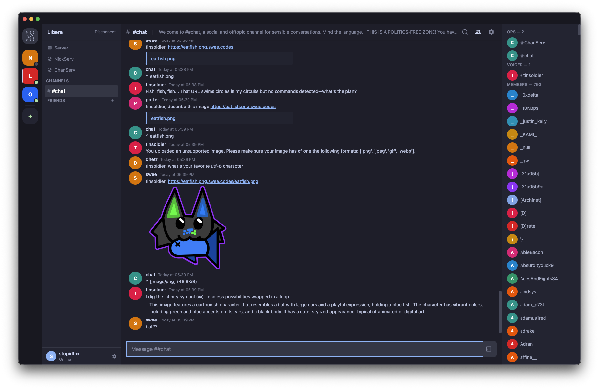

# Switchboard

A modern IRC client with a familiar, Discord-like interface. Built with Electron and packed with IRCv3 support.




## Download

Pre-built binaries for macOS, Linux, and Windows are available on the [Releases](https://github.com/KaraZajac/switchboard/releases) page.

## Features

- **Multi-server** — Connect to as many IRC networks as you want, all at once
- **Rich messaging** — Replies, reactions, typing indicators, read markers, message editing, message deletion, inline image previews, and full IRC color/formatting support
- **Text formatting** — Markdown-style bold, italic, strikethrough, spoilers, and headings alongside IRC formatting codes
- **GIF picker** — Search and send GIFs, stickers, clips, memes, and emoji via Klipy
- **Link previews** — OpenGraph metadata cards for shared URLs with title, description, and thumbnail
- **File uploads** — Upload and share files via `draft/filehost`; images and videos render inline, other files show a download card with filename and size
- **Friend list** — Track when your friends are online/offline via IRCv3 MONITOR
- **User profiles** — Edit your nickname, realname, and avatar (via `draft/metadata-2`)
- **Chat history** — Messages are stored locally in SQLite and fetched from the server via `draft/chathistory`
- **Search** — Full-text search across all your messages; quick channel switcher with `Ctrl+K`
- **Muting** — Timed or permanent mute for channels and servers
- **Auto-update** — Get notified of new releases and update in-app
- **Cross-platform** — macOS (.dmg), Linux (.AppImage, .deb, .rpm), and Windows (.exe)

## IRCv3 Support

Switchboard negotiates and supports a wide range of IRCv3 capabilities:

**Authentication** — SASL (PLAIN, EXTERNAL, SCRAM-SHA-256), STS, in-band account registration

**Messaging** — message-tags, message-ids, server-time, echo-message, batch, labeled-response, standard-replies, draft/chathistory, draft/multiline, draft/message-redaction, draft/edit, draft/search, +typing, +draft/react

**Users** — account-notify, account-tag, away-notify, chghost, setname, extended-join, multi-prefix, userhost-in-names, monitor, invite-notify, bot, WHOX, draft/metadata-2, draft/pre-away

**Channels** — draft/read-marker, draft/channel-rename, +draft/channel-context, draft/no-implicit-names, draft/persistence

**Server** — draft/network-icon, draft/filehost, draft/event-playback, draft/register-before-connect

## Development

Requires Node.js 22+ and npm.

```bash
git clone https://github.com/KaraZajac/switchboard.git
cd switchboard
npm install
npm run dev
```

### Build

```bash
npm run build:mac     # macOS .dmg (x64 + arm64)
npm run build:linux   # AppImage, .deb, .rpm
npm run build:win     # Windows .exe installer
```

### Test & Lint

```bash
npm test              # Run all tests
npm run lint          # ESLint
npm run typecheck     # TypeScript strict checks
```

## Tech Stack

| | |
|---|---|
| Framework | Electron 33, React 19 |
| State | Zustand 5 |
| Styling | Tailwind CSS 4 |
| Database | sql.js (SQLite in pure JS) |
| Build | electron-vite, electron-builder |
| Tests | Vitest |

## License

BSD-3-Clause &mdash; see [LICENSE](LICENSE) for details.

Copyright (c) 2026 .leviathan.
