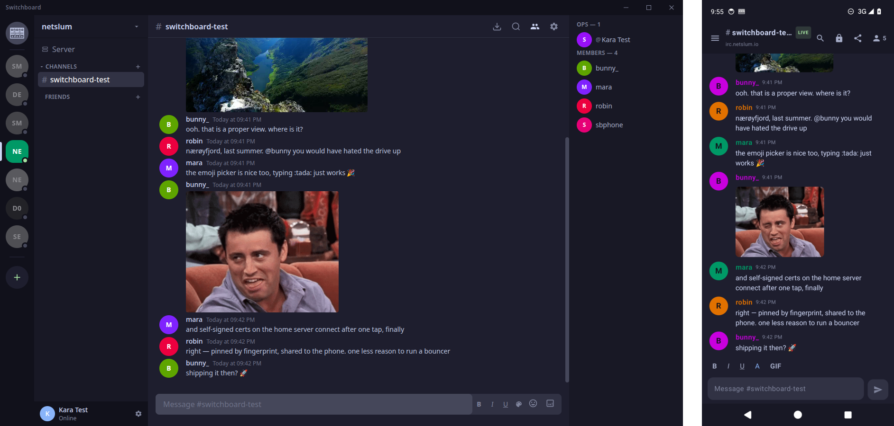

# Switchboard

A modern IRC client with a familiar, Discord-like interface. Built with Electron and packed with IRCv3 support.




## Download

Pre-built binaries for macOS, Linux, and Windows are available on the [Releases](https://github.com/KaraZajac/switchboard/releases) page.

## Features

- **Multi-server** — Connect to as many IRC networks as you want, all at once
- **Rich messaging** — Replies, reactions, typing indicators, read markers, message editing, message deletion, inline image previews, and full IRC color/formatting support
- **Text formatting** — Markdown-style bold, italic, strikethrough, spoilers, and headings alongside IRC formatting codes
- **GIF picker** — Search and send GIFs, stickers, clips, memes, and emoji via Klipy
- **Link previews** — OpenGraph metadata cards for shared URLs with title, description, and thumbnail
- **File uploads** — Upload and share files via `draft/filehost`; images and videos render inline, other files show a download card with filename and size
- **Friend list** — Track when your friends are online/offline via IRCv3 MONITOR
- **User profiles** — Edit your nickname, realname, and avatar (via `draft/metadata-2`)
- **Chat history** — Messages are stored locally in SQLite and fetched from the server via `draft/chathistory`
- **Search** — Full-text search across all your messages; quick channel switcher with `Ctrl+K`
- **Muting** — Timed or permanent mute for channels and servers
- **Auto-update** — Get notified of new releases and update in-app
- **Cross-platform** — macOS (.dmg), Linux (.AppImage, .deb, .rpm), and Windows (.exe)

## Two clients, one you

Switchboard is a desktop app and an [Android app](android/), and the point of
having both is that you can put one down and pick the other up. Three separate
mechanisms make that work, and they are worth telling apart because they fail
differently.

**The shared config travels between the devices.** Pair them once and they hold
one encrypted vault between them: the networks, the credentials, your profile,
your mutes, your friend list, and which channels to join on connect. Either
device can change any of it; whichever seals a newer version offers it, and the
other pulls. The passphrase never crosses the wire — only the sealed envelope
does — and a paired device is never handed a password in the clear through any
other channel.

**Both devices can be on the network at once**, where the server allows it. IRC
lets two connections share a nick when both have authenticated to the same
account — rIRCd calls this `multiclient` — so on those networks nobody stands in
for anybody: both clients connect, both see everything, and switching is
picking up the other device. The client's precondition is a saved SASL
mechanism and password, which is why the account screen offers to remember one.
Where a network refuses, the second connection is offered `nick_` instead of the
nick it asked for; it notices, gives the connection back, and falls back to the
older arrangement below.

**Where a network allows only one of you**, the two devices take turns. The
desktop holds the connections whenever it is running; when it stops, the phone
notices the heartbeat lapse, opens the vault and takes over, and hands back when
the desktop returns. The phone is a window onto the desktop's connections the
rest of the time.

What was said while a device was closed comes from the network, not from the
other device: `CHATHISTORY AFTER` catches a channel up on rejoining, and
`CHATHISTORY TARGETS` finds the conversations that started while you were away —
a direct message from somebody new leaves nothing else behind to notice. Read
state travels the same way: `draft/read-marker` means reading something at your
desk puts the badge out on your phone, and stops it buzzing about it.

## A third one, with no screen

`npm run build:headless` produces a Switchboard with no window — the same
engine, meant for a machine that stays on. Put it on a server and the taking
turns above stops happening: it outranks both devices and never leaves, so the
nick is held continuously and nothing hands over.

It is also a bouncer in the ordinary sense. It listens on IRC, so irssi,
WeeChat, Halloy, Textual or Switchboard itself attaches to it and arrives
already joined to your channels, under your nick, with the last of what was
said while you were away. Several clients can be attached at once and each sees
what the others say — typing, reactions, replies, edits and redactions all
included, because an attached client is offered every capability the network
agreed to. Networks can be added and changed over `soju.im/bouncer-networks`,
the same extension Switchboard speaks when it is the one talking to a soju.

Pair your devices to it and the hand-over goes three deep. The always-on
instance holds; if it stops the desktop takes over within about twenty seconds
and the phone keeps following the desktop; if the desktop stops too the phone
takes over. Everything hands back when it returns, and none of it needs you.

None of it is required. If you already run soju, add it to Switchboard as a
network and both devices attach to that instead.

[How to run it →](docs/headless.md)

## IRCv3 Support

Switchboard negotiates and supports a wide range of IRCv3 capabilities:

**Authentication** — SASL (PLAIN, EXTERNAL, SCRAM-SHA-256), STS, in-band account registration

**Messaging** — message-tags, message-ids, server-time, echo-message, batch, labeled-response, standard-replies, draft/chathistory, draft/multiline, draft/message-redaction, draft/edit, draft/search, +typing, +draft/react

**Users** — account-notify, account-tag, away-notify, chghost, setname, extended-join, multi-prefix, userhost-in-names, monitor, invite-notify, bot, WHOX, draft/metadata-2, draft/pre-away

**Channels** — draft/read-marker, draft/channel-rename, +draft/channel-context, draft/no-implicit-names, draft/persistence

**Server** — draft/network-icon, draft/filehost, draft/event-playback, draft/register-before-connect

Files go to the network's own filehost where it advertises one: an attach
button, a drop on the composer, or a paste, and the link goes out as the
message with the picture shown in place. Switchboard asks the filehost what it
takes before sending anything, so a refusal arrives before the upload rather
than after it, and it will not use a plaintext upload address on an encrypted
connection. `scripts/filehost.mjs` is a filehost written from the spec, for
developing against.

## Development

Requires Node.js 22+ and npm.

```bash
git clone https://github.com/KaraZajac/switchboard.git
cd switchboard
npm install
npm run dev
```

### Build

```bash
npm run build:mac     # macOS .dmg (x64 + arm64)
npm run build:linux   # AppImage, .deb, .rpm
npm run build:win     # Windows .exe installer
```

### Test & Lint

```bash
npm test              # Run all tests
npm run lint          # ESLint
npm run typecheck     # TypeScript strict checks
```

## Tech Stack

|           |                                 |
| --------- | ------------------------------- |
| Framework | Electron 33, React 19           |
| State     | Zustand 5                       |
| Styling   | Tailwind CSS 4                  |
| Database  | sql.js (SQLite in pure JS)      |
| Build     | electron-vite, electron-builder |
| Tests     | Vitest                          |

## License

BSD-3-Clause &mdash; see [LICENSE](LICENSE) for details.

Copyright (c) 2026 .leviathan.
